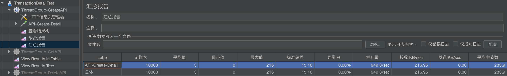
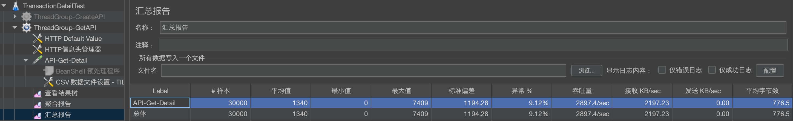

# 项目说明 [English Version](./README_en.md)

本项目是一个简单的交易管理服务，目前仅支持交易详情的添加、查询、列表、修改和删除等功能。

# 项目结构

项目基于领域驱动设计（DDD）的思想，实现了领域层、基础设施层、应用层、接口层和 Web 层的分离：

```
transaction-manager: 交易管理服务（总服务）
├── transaction-auth: 交易认证服务（待扩展）
├── transaction-securyti: 交易安全服务（待扩展）
└── transaction-detail: 交易详情服务（简单实现）
    ├── transaction-detail-domain: 领域层
    ├── transaction-detail-infra: 基础设施层
    ├── transaction-detail-app: 应用层
    ├── transaction-detail-interface: 接口层
    ├── transaction-detail-web: Web 层
    └── transaction-detail-docker: Docker 镜像服务
```

# 技术亮点

## 技术栈

编程语言：JDK 21

后端框架：SpringBoot 3.2.3

数据持久层：暂未使用数据库，仅使用内存缓存来保存数据
> 未来可能会使用数据库（如 MySQL 等）来存储数据，本项目支持插件化扩展缓存层的能力，可通过 `service.storage.type` 参数来控制。

## 架构简介

本服务基于 SpringBoot 3.2.3 框架开发，使用了 Spring 的事件监听机制，异步处理存入、取出、转出等交易流程，提高交易系统的吞吐。

部署工具方面，本服务支持：

- 通过 Maven 工具，可快速编译、打包，并通过提供的启动、停止和重启脚本快速部署服务，参考：[本地部署服务](./transaction-detail/README.md)

- 通过构建 Docker 镜像、运行 Docker 容器的方式部署，请参考：[通过 Docker 部署服务](./transaction-detail/transaction-detail-docker/README.md)

## 主要接口说明

| 接口名称 | 功能描述    | 请求方法 | 接口请求地址                                  |
| ------ |------------|--------- |--------------------------------------------|
| 创建 | 创建交易明细    | POST   | http://127.0.0.1:8080/v1/detail/create       |
| 查询 | 查询交易明细    | GET    | http://127.0.0.1:8080/v1/detail/get/{tid}    |
| 列表 | 查询交易明细列表 | GET    | http://127.0.0.1:8080/v1/detail/list         |
| 更新 | 更新交易明细    | PUT    | http://127.0.0.1:8080/v1/detail/update       |
| 删除 | 删除交易明细    | DELETE | http://127.0.0.1:8080/v1/detail/delete/{tid} |


## 主要三方依赖

| 主要依赖                  | 作用                                                         |
| ------------------------ | ----------------------------------------------------------- |
| spring-boot-*            | Spring Boot 的核心依赖，包括自动配置、依赖注入、嵌入式 Tomcat 等   |
| spring-*                 | Spring 框架和 Spring MVC 的核心功能                            |
| lombok                   | 通过注解简化 Java 代码，如自动生成 Getter/Setter、构造函数等       |
| httpclient5              | Apache HttpClient 5，提供 HTTP 客户端相关功能，用于发送 HTTP 请求 |
| jackson-*                | 提供 JSON 解析和生成、注解、JSON 与 Java 对象之间的绑定等功能       |
| jakarta-*                | 提供 Servlet API、注解的支持，以及对 Bean 的验证等功能            |
| commons-*                | 提供常用的字符串处理、集合处理工具类                              |
| knife4j-openapi3-*       | 提供 API 文档生成和展示功能                                     |
| swagger-annotations      | 提供 Swagger 注解支持，用于生成 API 文档                         |
| slf4j-api                | 提供日志门面接口                                               |
| log4j-*                  | 提供 Log4j 2 相关功能                                          |
| spring-boot-starter-test | 提供 Spring Boot 的测试支持，如单元测试、集成测试等                |
| mockito-core             | 提供 Mock 对象支持，用于单元测试                                 |


# 服务性能测试

为了评估本服务的主要接口在高并发场景下的性能表现，找出性能瓶颈，为后续的优化和扩容提供依据，特进行性能（压力）测试。

## 压测环境

| 环境信息  | 详情                                                                                                 |
|----------|-----------------------------------------------------------------------------------------------------|
| 服务器硬件 | - CPU：Apple M1 Pro <br/> - 内存：8G <br/> -磁盘：SSD                                                 |
| 服务器软件 | - 操作系统：Debian GNU/Linux 12 (bookworm) <br/> - Web 服务器：Tomcat 10.1.9 <br/> - 数据库：LPDDR5 内存 |
| 网络环境  | 本地直接访问，延迟 1ms 以内                                                                             |

## 压测工具

使用 Apache JMeter 进行压测。

## 测试计划

请参考此文件：[TransactionDetailTest.jmx](./docs/pressure-test/TransactionDetailTest.jmx)，可使用 JMeter 打开。

## 测试结论

| 接口名称 | 并发数   | 最大 QPS   | 平均响应时间（ms） | 错误率（%）  |
|---------|--------|------------|-----------------|-------------|
| 创建接口 | 5000    | 949       | 3                | 0.00       |
| 查询接口 | 10000   | 2897      | 1340             | 9.12       |


- 创建接口结果图：

  

- 查询接口结果图：

  

