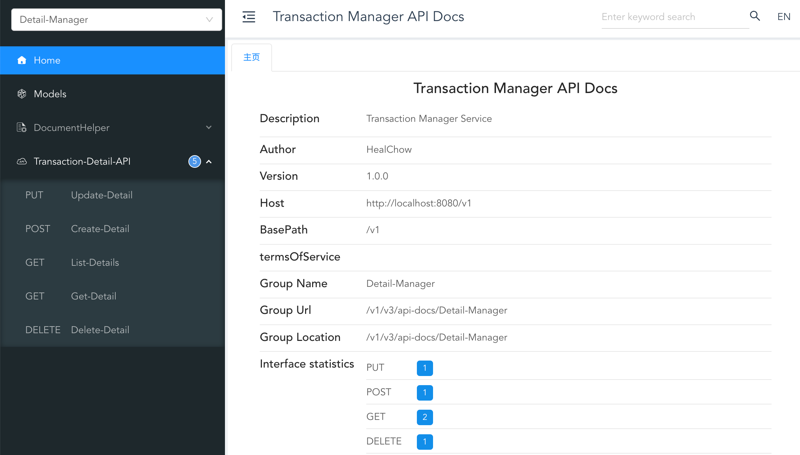

# Transaction Detail Service

## Build Project

Navigate to the module `transaction-manager/transaction-detail` and package the service using Maven:

```shell
mvn clean package -DskipTests=true -P docker-arm64
```

## Update Configuration

Navigate to the module `transaction-detail/transaction-detail-web/target` and unpack the package:

```shell
mkdir -p detail-web
tar -zxvf transaction-detail-web-1.0.0.tar.gz -C detail-web
```

Then navigate to the `transaction-detail-web/conf` directory and modify the `application.properties` and other configuration files as needed.

## Start Service

In the `detail-web` directory, execute the following commands to startup, shutdown, or restart the service:

```shell
# startup service
./bin/startup.sh

# shutdown service
./bin/shutdown.sh

# restart service
./bin/restart.sh
```

## Access the Service

Access `http://127.0.0.1:8080/v1/doc.html` in a web browser to browse the service documents.

As shown in the figure below:


